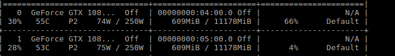

# Simple example for pytorch distributed training, with one machine, multi gpu.

### With pytorch distributed training, we can Synchronize BN in multi gpu.

### Just follow the step in .py file.

### To train with distributed training:

```
python -m torch.distributed.launch --nproc_per_node=2 multi_gpu_distributed.py
```


